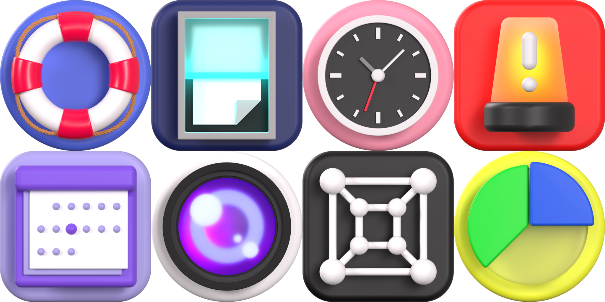

# Super Icons 3D World
An unofficial 3D icon pack for Linux GNOME inspired by the default Adwaita icons.

This project is not affiliated with or endorsed by the GNOME Foundation.

## Credits & Resources
* **Models & Renders:** Created entirely from scratch by me, Zachary Stofko.
* **Rendering Software:** Built and rendered using [Blender](https://www.blender.org/).
* **Environment Lighting:** Uses the [Monochrome Studio 02 HDRI](https://polyhaven.com/a/monochrome_studio_02) from Poly Haven.
* **Image Processing:** Batch-downscaling handled via [Converseen](https://converseen.fasterland.net/).

## Q & A
* **Q:** Do I take requests?
  **A:** Request away! However, the icons I choose to make depend on personal bias and variety.
